En este cuarto ejercicio, la plataforma nos enseñará otro modo de combinar los trabajos realizados en el proyecto.

# Introduccion

Esta nueva forma de combinación se conoce por el nombre de "rebase". En la imagen a continuación se nos ofrece una pequeña explicación de qué consiste este método

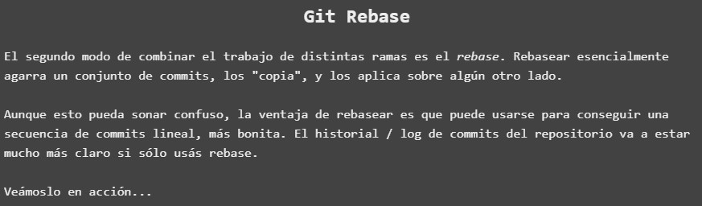

Como podemos entender, el rebase consistirá en aplicar a la linea principal de proyecto el conjunto de entregas que se han ido realizando en ramas a medida que hemos avanzado en el proyecto. Con esto conseguieremos una linea principal de proyecto mas limpia y organizada

Asi pues, una vez llegados a este punto, comenzamos a realizar el ejercicio:

# Conceptualización de ejercicio

En la parte introductoria del ejercicio, se nos muestra otra explicación que puede ayudarnos a comprender mejor este concepto

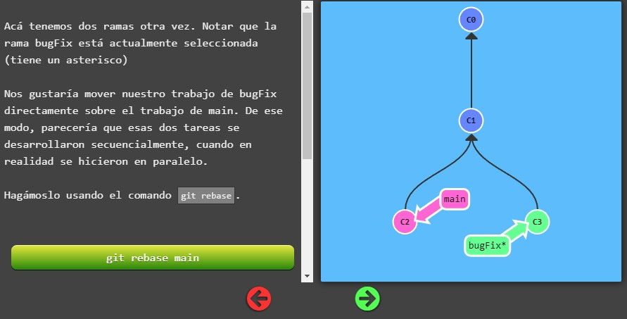

Podemos ver que el rebase consistirá en añadir el contenido de una rama anexa a la principal y colocarlo por delante de él en la linea evolutiva del proyecto, sin embargo es tambien necesario actualizar la rama main para que esté a la altura de la rama rebaseada

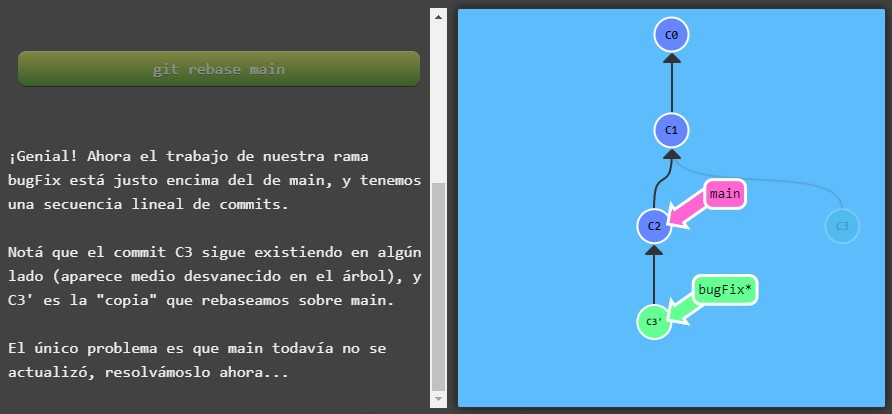

Quedando como resultado ambas en la misma linea de proyecto

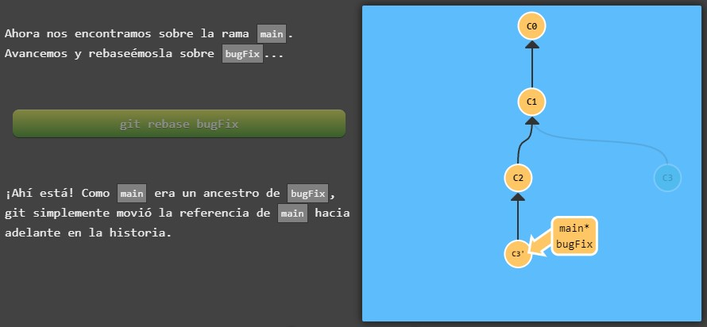

LLegados a este punto, se nos muestran ya los pasos para la resolución del mismo

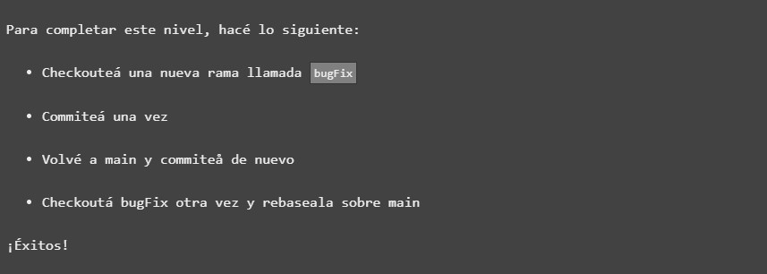

# Resolviendo ejercicio

Comenzamos desde la rama principal main*, en la linea de comandos, tendremos que hacer un **checkout** a la nueva rama bugFix

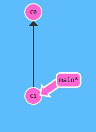

En primer lugar creo la rama llamada bugFix con **git branch bugFix** y mediante el comando **checkout bugFix** saltamos a ella

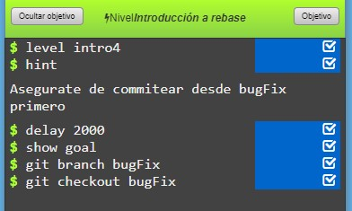

Podemos ver que nos encontramos en la rama bugFix gracias al asterisco sobre ella(*)

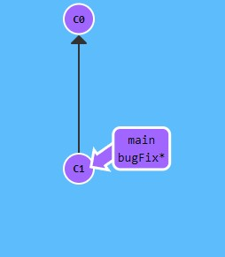

Una vez creada, hacemos commit de ella mediante el comando que ya conocemos **git commit**

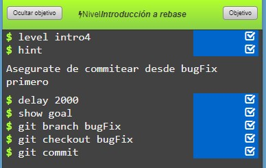

Vemos como en el diagrama ahora nos encontramos en la entrega propia de la rama

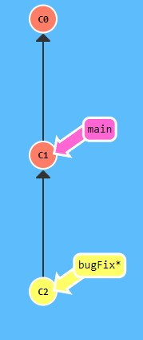

Para realizar el rebase, tendremos que volver a la rama principal **main** y hacer un commit del mismo. 

**Aplicamos git checkout main y git commit para lograr tal proposito**

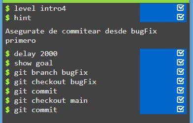

Podemos ver como se desglosa la rama principal:

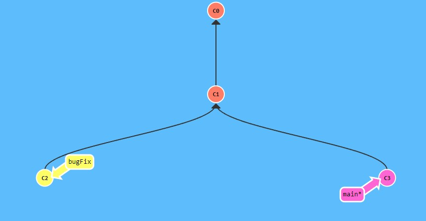

Finalizamos el rebase aplicando:

- Salto a la rama bugFix

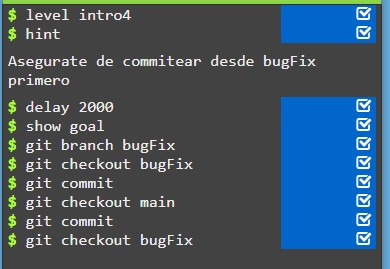

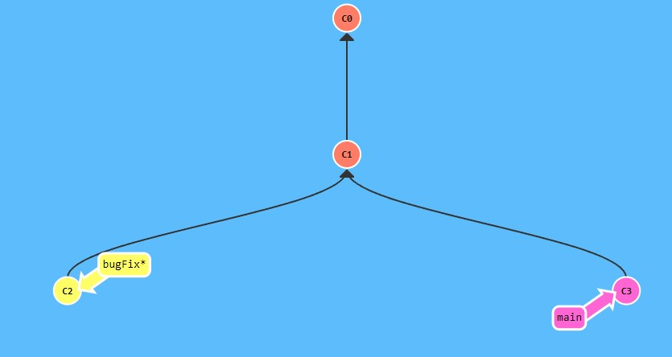

- Rebaseo sobre la rama main con el comando **git rebase**

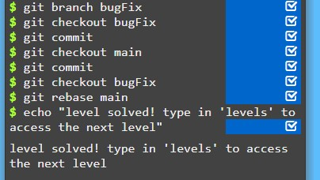

Y vemos como, efectivamente, la rama bugFix ha entrado a formar parte de la rama principal, resolviendo de esta forma el ejercicio

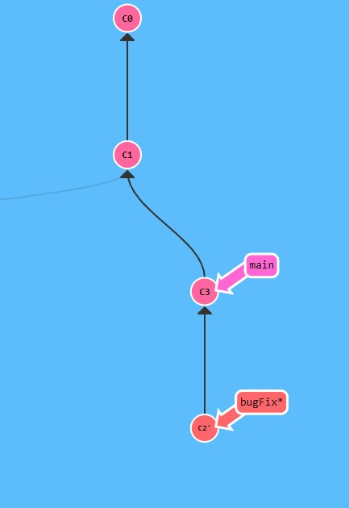

> En este punto podríamos hacer commit de main para ponerlo a la misma altura de proyecto que el rebase realizado de bugFix sobre main, pero el ejercicio finaliza al realizar dicho rebaseo

